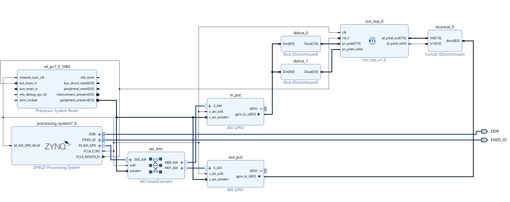
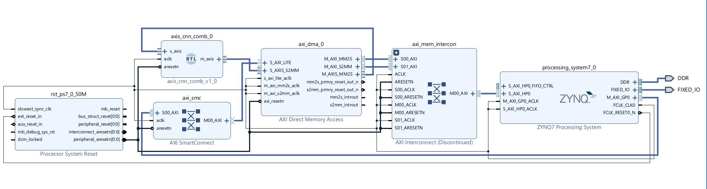
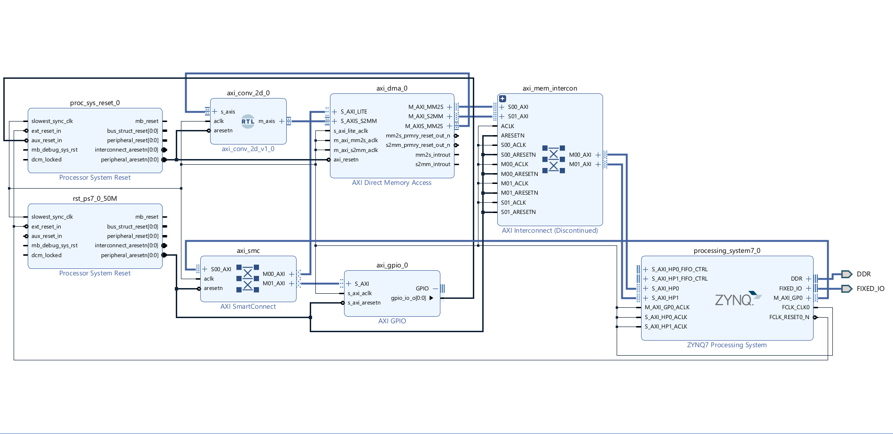

# Convolution on Zynq: Hardware Acceleration Evolution

This repository documents the iterative development of a custom 2D Convolution hardware accelerator on the Zynq-7000 (Cora Z7). The project transitions from a basic software-controlled prototype to a high-performance, fully pipelined 32-bit streaming engine.

## Project Overview
* **Goal:** Accelerate image convolution (Sharpening Filter) using custom FPGA logic.
* **Target:** Zynq-7000 SoC (Cora Z7).
* **Input/Output:** 28x28 Image processing (optimized for MNIST-scale inputs).
* **Result:** **22.8x speedup** over optimized software implementation.

## Repository Structure
```text

├── convolution-1/          # v1: GPIO Implementation
│   ├── conv_engine.v       # Basic arithmetic logic
│   └── project.bit         # Bitstream
├── convolution-2/          # v2: DMA Single-Port
│   └── design.v            # Updated wrapper
└── convolution-3/          # v3: Dual-Port Streaming (Current)
    ├── 001top.v            # AXI Stream Wrapper
    ├── 002control.v        # Output Logic
    ├── 003linebuffer.v     # Row caching
    ├── 004window_manger.v  # 5x5 Window generation
    ├── 005convolution.v    # Math core (Sharpening)
    ├── benchmark.ipynb     # Jupyter notebook for performance testing
    └── tb.sv               # SystemVerilog Testbench
```
## The Evolution Roadmap
This project was built in three distinct stages, optimizing data movement at every step:

### v1.0: Proof of Concept (GPIO)
* **Architecture:** CPU sends pixels one-by-one via AXI GPIO.
* **Bottleneck:** CPU-bound. The high-speed FPGA logic sat idle waiting for software to toggle pins.
* **Kernel:** 3x3 (8-bit).


### v2.0: DMA Integration (Single Port)
* **Architecture:** Replaced GPIO with AXI DMA. CPU sets up buffer descriptors; hardware pulls data.
* **Bottleneck:** Memory contention. Single High-Performance (HP) port handled both read and write streams, causing bus stalling.


### v3.0: High-Performance Streaming (Dual Port)
* **Current Production Build.**
* **Architecture:** Split data paths into **Dual HP Ports** (`S_AXI_HP0` for Read, `S_AXI_HP1` for Write).
* **Core Upgrade:** Expanded to a **5x5 Signed Kernel** with a hardcoded sharpening filter.


## RTL Architecture (v3.0)
The custom IP (`axi_conv_2d`) is designed as a fully streaming AXI4-Stream peripheral:

* **Top Level (`001top.v`):** Handles AXI Stream handshaking (`tvalid`, `tready`, `tlast`) and pipeline flushing.
* **Line Buffers (`003linebuffer.v`):** Instantiates 4 line buffers (RAM) to cache previous image rows, enabling single-pass 5x5 processing.
* **Window Manager (`004window_manger.v`):** Shift-register logic that constructs a 5x5 sliding window from the line buffers.
* **Math Core (`005convolution.v`):** * Implements a fixed **5x5 Laplacian-style Sharpening kernel**.
    * Utilizes a 4-stage arithmetic pipeline (Multiply → Row Sum → Accumulate).
    * Handles **signed 32-bit integer** arithmetic.
* **Control Unit (`002control.v`):** Manages output timing, crops padding pixels, and generates the `tlast` signal for the DMA.

## Performance Benchmarks (v3.0)
without DSP

| Implementation | Kernel Size | Execution Time | Speedup |
| :--- | :--- | :--- | :--- |
| Python (SW) | 5x5 Signed | 75.02 ms | 1x |
| SciPy (SW) | 5x5 Signed | 1.2012 ms | 62.43x |
| **FPGA (HW)** | **5x5 Signed** | **0.42 ms** | **179.06** | **2.86**(vs SciPy) |

With DSP

| **FPGA (HW)** | **5x5 Signed** | **0.43 ms** | **174.4** |


