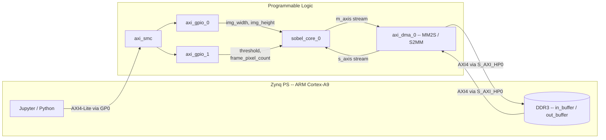
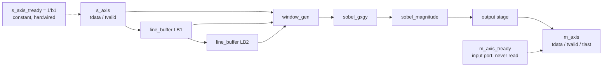
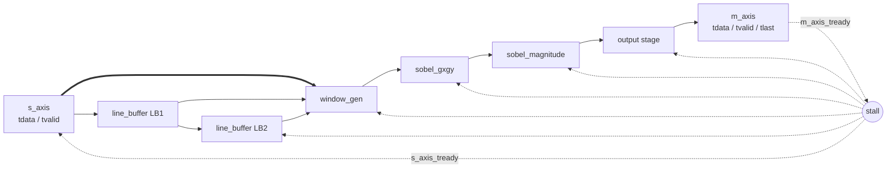

# Sobel Edge Detection Accelerator — PYNQ-Z2
> [!WARNING]  
> Work In Progress: The hardware implementation of this Sobel accelerator is 
> complete and running on the board. Full testbench verification is currently 
> in progress to iron out minor pipeline delay bugs. Feel free to explore the code, 
> but please note it is actively being debugged.
Real-time Sobel edge detection implemented as hand-written Verilog RTL on a Zynq-7020 (PYNQ-Z2), streaming pixels through a fully pipelined, multiplier-free datapath at 1 pixel/clock. Control (image size, threshold) is set at runtime from Python; pixel data moves via AXI DMA over the Zynq's high-performance AXI port.
## Overview

| Attribute | Value |
|-----------|-------|
| **Platform** | PYNQ-Z2 (Zynq XC7Z020-1CLG400C, dual-core ARM Cortex-A9 + Artix-7-class programmable logic) |
| **Algorithm** | Sobel gradient magnitude, thresholded to a binary edge map |
| **Datapath** | Fully custom Verilog — line buffers, sliding window, gradient computation, all built from adders/shifts, zero DSP multipliers |
| **Interfaces** | AXI4-Stream for pixel data (via AXI DMA), AXI4-Lite (via AXI GPIO) for runtime configuration |
| **Host side** | Python/Jupyter via PYNQ, using `pynq.allocate` buffers and `Overlay` for bitstream + driver loading |

---

## System Architecture



Two independent paths, carrying deliberately different kinds of traffic:

| Path | Bandwidth | Carries | Route |
|------|-----------|---------|-------|
| **Control** | Low, once per frame | `img_width`, `img_height`, `threshold`, `frame_pixel_count` | Python → `axi_smc` → `axi_gpio_0` / `axi_gpio_1` → `sobel_core_0` |
| **Data** | High, every clock cycle | Individual pixels | DDR3 → `axi_dma_0` (MM2S) → `sobel_core_0.s_axis` → `sobel_core_0.m_axis` → `axi_dma_0` (S2MM) → DDR3 |

> **Note:** The data path specifically uses `S_AXI_HP0` rather than `M_AXI_GP0` because HP ports are built for bulk DDR bandwidth; GP0 is a narrow port meant for light control-register traffic — using GP0 for pixel data would bottleneck the whole design.

---

## The Math Behind Sobel Edge Detection

An image is a discrete function $I(x, y)$. An edge is a location where intensity changes sharply — where the gradient $\nabla I = (\partial I / \partial x, \partial I / \partial y)$ is large.

### Discrete Derivative

A Taylor expansion around $x$ gives the central difference:

$$I'(x) \approx \frac{I(x+1) - I(x-1)}{2} \quad \Rightarrow \quad \text{kernel } [-1,\ 0,\ 1]$$

### The Noise Problem

A bare difference kernel amplifies high-frequency noise. Sobel smooths first, using $[1, 2, 1]$ — a cheap, integer-only approximation of Gaussian smoothing (it's literally $[1, 1] * [1, 1]$).

### Separability

Sobel's kernels factor into an outer product of a smoothing pass and a differencing pass, applied on perpendicular axes:

$$G_x = \begin{bmatrix} 1 \\ 2 \\ 1 \end{bmatrix} \begin{bmatrix} -1 & 0 & 1 \end{bmatrix} = \begin{bmatrix} -1 & 0 & 1 \\ -2 & 0 & 2 \\ -1 & 0 & 1 \end{bmatrix}$$

$$G_y = \begin{bmatrix} -1 \\ 0 \\ 1 \end{bmatrix} \begin{bmatrix} 1 & 2 & 1 \end{bmatrix} = \begin{bmatrix} -1 & -2 & -1 \\ 0 & 0 & 0 \\ 1 & 2 & 1 \end{bmatrix}$$

Every coefficient is $\{0, \pm 1, \pm 2\}$ — multiply-by-2 is a left shift, multiply-by-1 is free. The entire filter reduces to adders and shifts; **no DSP multiplier blocks are used**.

### Adder-Tree Form

Using window labels $a\ b\ c$ / $d\ e\ f$ / $g\ h\ i$ (top-left to bottom-right; $e$, the center pixel, appears in neither kernel):

```
colL = a + 2d + g       colR = c + 2f + i       Gx = colR - colL
rowT = a + 2b + c       rowB = g + 2h + i       Gy = rowB - rowT
```

**10 add/subtract operations total, no multipliers.**

### Magnitude and Threshold

True magnitude is $\sqrt{G_x^2 + G_y^2}$; this design approximates it as $|G_x| + |G_y|$ (2 sign-based negations + 1 add — again, no multiplier), then compares against a runtime threshold:

$$
\text{edge}(x, y) = \begin{cases}
0xFF & |G_x| + |G_y| \ge T \\
0x00 & \text{otherwise}
\end{cases}
$$

---

## RTL Pipeline and Datapath



One pixel enters every clock cycle and moves through five stages:

| Stage | Module | Function |
|-------|--------|----------|
| 1–2 | `line_buffer` × 2 | Circular BRAM buffer, read-before-write, each delaying the stream by exactly one image row. Chained, they give simultaneous access to the current row and the two rows above it. |
| 3 | `window_gen` | The three row-taps naturally arrive 0/1/2 cycles apart (registered latency through the line buffers). Two internal delay registers (`row_mid_d1`, `row_bot_d1` → `row_bot_d2`) re-align them to the same cycle before they're shifted into a live 3×3 register array (`w00`..`w22`). |
| 4 | `sobel_gxgy` | The adder-tree math above, applied to the current window. |
| 5 | `sobel_magnitude` | $\|G_x\| + \|G_y\|$, compared against threshold. |
| Output | `sobel_core`'s output always block | Packs the result onto `m_axis_tdata`; counts output pixels against `frame_pixel_count` to assert `m_axis_tlast` on the frame's final pixel. |

> **Why the `window_gen` alignment matters:** Without it, the three taps would shift into the window on different cycles, silently building a skewed window — pixels from the wrong column relative to each other. Every subsequent computation would be wrong in a way that isn't obviously wrong just from looking at the output.

---

## Data Flow and Dimensions

| Stage | Shape / Size | Notes |
|-------|-------------|-------|
| `Image.open(path).convert("L")` | Original resolution, 8-bit | Grayscale |
| `.resize((W, H))` = `.resize((640, 480))` | 640 × 480 | PIL takes `(width, height)` |
| `np.array(img_resized)` | Shape `(480, 640)` | NumPy is `(rows, cols)` = `(H, W)` — transposed order from PIL's argument, confirmed by the printed shape |
| `in_buffer = allocate(shape=(H, W))` | 307,200 bytes | Physically contiguous DDR3, row-major: byte 0 = pixel(0,0), byte 640 = pixel(1,0)... |
| `dma.sendchannel.transfer(in_buffer)` | 307,200 beats | DMA re-serializes from wide DDR bursts to one 8-bit `tdata` beat/cycle on `M_AXIS_MM2S` |
| `sobel_core` | 307,200 in → 307,200 out | Every module is strictly one-in-one-out — no position is ever skipped |
| `out_buffer` | 307,200 bytes | Same shape, same order, written back by S2MM |

Pixel count is always preserved — but that's not the same as every pixel being a mathematically valid Sobel result. A textbook "valid" 3×3 convolution can only be centered where a complete neighborhood exists — rows $1..H-2$, columns $1..W-2$ — which is why `scipy.signal.convolve2d(img, kernel, mode='valid')` returns a smaller array: $(H-2)(W-2) = 304{,}964$ pixels, 2,236 fewer than the full frame.

This design **doesn't crop**. The line buffers and window register have no concept of "row" or "frame" boundary — they slide across one continuous raster stream. Concretely, at exactly the positions valid convolution would exclude:

- **Column 0 and column $W-1$ of every row:** the window straddles the row seam, blending the tail of one row with the head of the next.
- **Row 0:** needs "row −1," which the line buffers happily supply anyway — whatever was last in that BRAM address. On the very first frame after reset, that's reset-state content; on any later frame in the same session, since the line buffers are never cleared between calls, it's literally the tail of the previous frame processed.
- **Row $H-1$:** symmetrically built from whatever streams in immediately after the frame ends.

That's an exact 1-pixel-wide ring: $307{,}200 - 304{,}964 = 2{,}236$ pixels, ≈0.73% of a 640×480 frame — the same arithmetic as the "shrinkage" in valid convolution, just relocated from "cropped away" to "present but contaminated."

---

## Flow Control and Backpressure

This design **does not implement dynamic backpressure**. Directly from the RTL:

```verilog
assign s_axis_tready = 1'b1; // always ready to receive a pixel — no backpressure handling
```

`m_axis_tready` is declared as a port but **never referenced anywhere in the logic** — the pipeline runs at a fixed 1 pixel/clock regardless of whether the DMA's S2MM channel could theoretically apply backpressure.


### Why This Is a Deliberate, Justified Simplification

The core's maximum possible output rate is hard-capped by AXI4-Stream itself at 1 byte/clock — roughly 100 MB/s at a 100 MHz design clock. `axi_dma_0`'s S2MM channel writes to DDR3 over `S_AXI_HP0`, and Zynq's DDR3 controller sustains write bandwidth well above that for the kind of efficient burst writes AXI DMA generates. With exactly one producer, one consumer, and nothing else contending for that HP0 port, the consumer's sustained capacity provably exceeds the producer's maximum rate — the condition under which skipping a live handshake is safe.

This assumption stops holding, and real backpressure becomes necessary, if:

- Another AXI-Stream consumer or producer starts sharing the same HP0 bandwidth
- Resolution or frame rate increases enough to meaningfully close the margin against DDR3's sustained (not peak) throughput
- The core is reused in a system where the sink isn't a dedicated point-to-point DMA link

---

## Reference Design for Full Backpressure

> **Not implemented in this repository has of now**

The general mechanism: a consumer that's occasionally unable to accept data has to signal "pause," and that signal has to travel backward, opposite to the data flow direction, reaching every stage between the bottleneck and the original source — not just the last one. One shared stall wire, fanned out identically to every register:


```verilog
wire stall = m_axis_tvalid & ~m_axis_tready;
assign s_axis_tready = !stall;
```

Every existing register gets `!stall` added to its enable condition:

---

## Control Interface and Register Map

| Register | Width | Channel | Actually Used For |
|----------|-------|---------|-------------------|
| `img_width` | 11 bits | `axi_gpio_0.channel1` (offset `0x0`) | Row length — sets the circular-buffer wraparound in both `line_buffer` instances |
| `img_height` | 11 bits | `axi_gpio_0.channel2` (offset `0x8`) | Declared, wired, **never read** inside `sobel_core` — see Known Limitations |
| `threshold` | 12 bits | `axi_gpio_1.channel1` (offset `0x0`) | Compared against $\|G_x\| + \|G_y\|$ in `sobel_magnitude` |
| `frame_pixel_count` | 32 bits | `axi_gpio_1.channel2` (offset `0x8`) | Compared against `out_count` to generate `m_axis_tlast` |

Implemented via two AXI GPIO cores (all-outputs) rather than a properly packaged AXI4-Lite slave — functionally equivalent, but without PYNQ's `register_map` auto-discovery; registers are addressed via `.channel1` / `.channel2` instead.

`sobel_core` never receives an `s_axis_tlast` from the DMA's MM2S side either — frame-end is entirely derived from `frame_pixel_count`, fully decoupled from what the DMA thinks. The two stay in sync only because Python sets `frame_pixel_count = W*H` to match the buffer sizes it allocates — there's no hardware cross-check between them.

---

## Known Limitations and Simplifications

1. **No dynamic backpressure** — see [Flow Control and Backpressure](#flow-control-and-backpressure). Safe under the current point-to-point, single-consumer configuration; would need the reference design if that changes.

2. **Unmasked borders** — a 1-pixel ring (~0.73% of a 640×480 frame) contains raw window content rather than a valid convolution result, including contamination from the previous frame at row 0 (line buffers are never cleared between calls to `edge_detection()`). See [Data Flow and Dimensions](#data-flow-and-dimensions).

3. **`img_height` is dead wiring** — present as a port, unused in the module body. Frame-end is fully handled by `frame_pixel_count` instead.

4. **Control path is AXI GPIO, not AXI4-Lite** — functional, but no `register_map` auto-discovery from Python.

5. **`s_axis_tlast` from the DMA is ignored** — frame boundary is entirely software-configured via `frame_pixel_count`, not cross-checked against the DMA's own transfer length.

---

