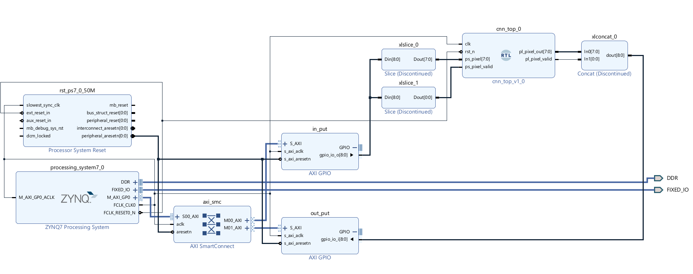

# Convolution on Zynq
A custom hardware implementation of 2D convolution on the Zynq-7000 (PYNQ-Z2), designed in Verilog and integrated with Python.

## Project Overview
This project implements a **Pipelined Convolution Engine** in Register Transfer Level (RTL) code. It demonstrates a complete Hardware-Software co-design flow, calculating image convolution in hardware while being controlled by a Python driver.

**Current Version (v1.0):**
* **Core Logic:** Custom Pipelined Adder Tree (9-tap kernel).
* **Interface:** AXI-Lite GPIO (Software-Controlled).
* **Verification:** Hardware-Software Co-design using PYNQ (Python).

## Key Features
* **Custom RTL Design:** 4-Stage pipeline implementing signed integer arithmetic.
* **Edge Detection Logic:** Robust input handling to synchronize high-speed FPGA logic (100MHz) with slower software control signals.
* **Clamping & Saturation:** Hardware-level handling of pixel overflow/underflow (0-255).
* **Bit-Accurate Verification:** Python testbench verifies hardware output matches the golden reference model 100%.

## Performance Analysis (v1.0)
* **Status:** Functionally verified.
* **Bottleneck:** The current design uses **AXI GPIO** for data transfer, which makes the system I/O bound. While the FPGA core computes in nanoseconds, the CPU-driven communication limits system throughput.

## Architecture & Results

*Figure 1: Vivado Block Design showing the custom IP integration.*
